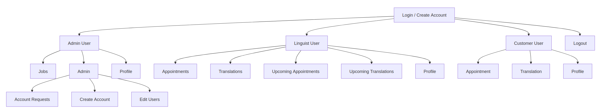

# User Guide

This document provides essential information to assist users in navigating workflows effectively.

# Introduction

### Purpose of this Guide
This guide serves as a long-term support resource for users, primarily for the Govan Community Project (GCP). It is designed to help new users understand the platform's structure and workflows.

### Intended Audience
The primary audience for this guide is internal members of GCP, enabling them to support staff, customers, and linguists. Some sections may be adapted for external users via the website or other means.

### System Overview
The platform is a simple web application accessible via a standard website link.

# Getting Started

### System Requirements
Users need a device with internet access and a web browser, ideally a desktop or laptop for the best experience.

### Login & Logout
Upon accessing the website, users are prompted to log in. The system automatically assigns roles based on user credentials.
- If login credentials are incorrect, users will be prompted to retry.

### Password Recovery
If a user forgets their password, they can use the **Forgot Password** button on the login page. A reset link will be sent to their registered email. Delivery times may vary depending on the email service provider (e.g., Google, Microsoft).

### User Roles & Permissions
There are three primary user roles:
- **Customer (Requester):** Can request appointments and view only relevant details.
- **Linguist (Interpreter):** Receives appointment and translation offers and can accept or decline them.
- **Admin:** Manages appointments, users, and system settings.

# General Features

### Key Functionalities
The system provides the following core functionalities:
- Booking appointments and requesting translations.
- Admin management of appointments and user data.
- Linguists accepting or declining job offers.

### User Settings
- Users can update personal details via the **Profile** tab.
- Admins can edit user details by accessing the **Admin** tab, selecting **Edit Profile**, and choosing a user from the dropdown menu.

### Notifications & Alerts
- Email notifications are sent when an appointment or translation request is offered or accepted.

# Site Map

# Admin

### Managing Appointments and Translations
Admins also have the ability to amend any details of an appointment or translation.

### Managing Users
Admins can edit user details, including:
- Email
- Password
- First & Last Name
- Phone Number
- Alternative Phone Number
- Notes
- Organisation (Customers only)
- Address & Postcode (Customers & Linguists only)
- Gender (Linguists only)
- Languages (Linguists only)

### Django Admin
The **Django Admin** interface provides advanced data management for system administrators. Access it via the provided admin URL and log in using admin credentials.

Key sections include:
- **Site Administration:** Track changes via the Administration Log.
- **User Management:** Organise users into groups and assign permissions.
- **Booking & Billing:** Manage appointments, customers, interpreters, and translations.
- **Content Types & Sessions:** Define content structures and monitor active user sessions.

**Best Practices:**
- Only modify data when necessary.
- Use search and filtering tools for efficiency.
- Assign permissions carefully.
- Regularly audit changes using the Admin Log.

# Linguist/Interpreter

### Job Assignments
Linguists can view and manage their upcoming translations and appointments. The **Appointments** and **Translations** pages display offers, which linguists can accept or decline based on their availability. Linguists can also amend releveant details of appointments and translations such as actual start time and and actual end time.

### Communication
Linguists have access to customer contact details to facilitate smooth communication and service delivery, via email.

# Customer

### Requesting Services
Customers can request:
- **Appointments** and **Translations** via their respective pages.
- Upload documents for translation, accessible to linguists.
- View all their submitted requests.

### Tracking Requests
Currently, customers cannot track request statuses in real time. A tracking system should be implemented to improve visibility.

### Communication & Feedback
Communication is currently handled via email between linguists and customers. Implementing an in-platform messaging system could enhance communication efficiency and record-keeping.

